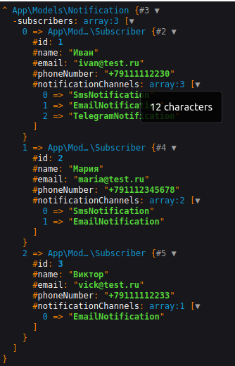

# Демонстрация SOLID принципов на примере уведомлений

## Управление уведомлениями
Данный пример демонстрирует организацию кода с использованием SOLID принципов.

### SOLID принципы
- Принцип единственный обязанности
- Принцип открытости/закрытости
- Принцип подстановки Барбары Лисков
- Принцип разделения интерфейса
- Принцип внедрения зависимостей

## Пример

